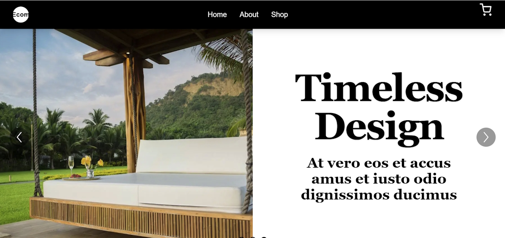
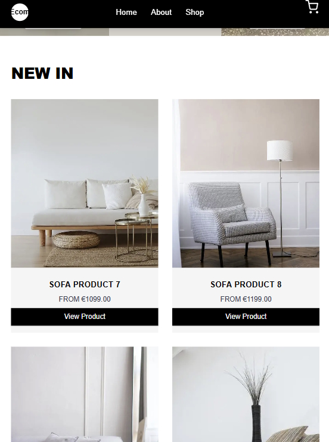
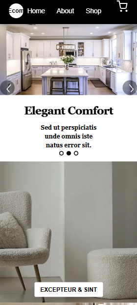
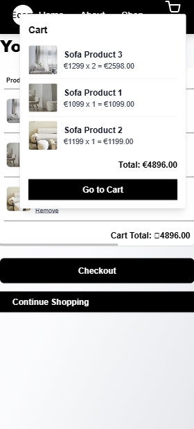

# Ecom Fancy

This is a dummy e-commerce web application built for demonstration and learning purposes. It showcases a modern, responsive online shop experience with a clean design and essential e-commerce features.

## Technologies Used

- **Next.js** (App Router)
- **React**
- **TypeScript**
- **Tailwind CSS**
- **LocalStorage** (for cart state)
- **Next/Image** (for optimized images)
- **Vercel** (deployment ready)

## Features

- Home page with carousel, featured sections, and deal banners
- Product grid and product details pages
- Category and price filtering, sorting
- Cart functionality with dropdown and cart page
- Checkout page with form and cart summary
- Sticky navigation and styled footer
- Responsive design for desktop and mobile

## Note

This project is for demonstration only. All products, images, and data are dummy and not for real commercial use.

---

Feel free to use this as a starting point for your own e-commerce projects!

## App Demo

[https://ecom-brown-six.vercel.app/](https://ecom-brown-six.vercel.app/)

## Screenshots

### Page
- Desktop (≥1280px)
  
  

- Tablet (~768–1024px)
  
  

- Mobile (≤430px)
  
  

- Mobile (≤430px) Products page

  

- Mobile (≤430px) Cart

  
